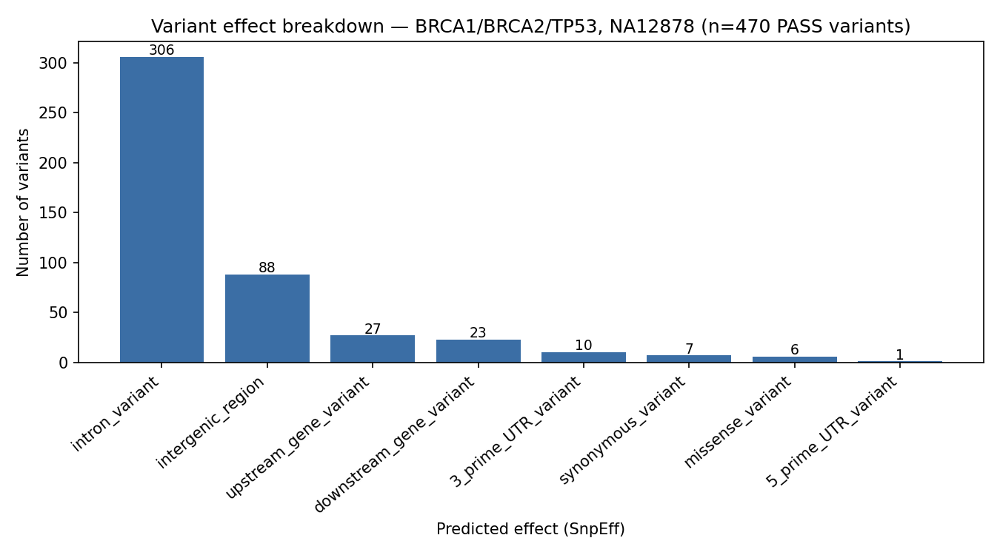

# Targeted Germline Variant Calling, Benchmarking, and Functional Annotation of BRCA1, BRCA2, and TP53

**Question:** How accurately can a GATK-based germline variant-calling pipeline identify small variants in BRCA1, BRCA2, and TP53 from real NA12878 (HG001) sequencing data, when evaluated against the independent Genome in a Bottle (GIAB) v4.2.1 truth set?

## Reproducing this pipeline

```bash
conda env create -f environment.yml
conda env create -f environment-annotation.yml   # SnpEff needs its own env

conda activate brca-germline
./scripts/01_prepare_reference.sh
./scripts/02_extract_target_reads.sh
./scripts/03_qc.sh
./scripts/04_alignment.sh
./scripts/05_preprocessing.sh
./scripts/06_variant_calling.sh
./scripts/07_filtering.sh

conda activate snpeff-env
./scripts/08_annotation.sh

conda activate brca-germline
./scripts/09_benchmarking.sh
python3 scripts/09_make_figures.py
```

Every script sources `config.sh`, so there are no hardcoded paths — the whole pipeline is portable to any machine with these two conda environments set up.

## Objective

Develop and evaluate a GATK Best Practices–based germline variant-calling pipeline for three clinically significant cancer-susceptibility genes (**BRCA1**, **BRCA2**, **TP53**), using real human sequencing data from the well-characterized reference sample **NA12878 (GIAB HG001)**. Pipeline performance was benchmarked against the Genome in a Bottle (GIAB) v4.2.1 truth set, and high-confidence variants were functionally annotated to characterize their predicted biological consequences.

This is a targeted-panel analysis, not a whole-genome study — sequencing reads and reference sequence were deliberately restricted to the three target genes to keep the project reproducible on standard hardware while still using unmodified, real human sequencing data throughout.

**Not a diagnostic tool.** This project does not diagnose disease, does not claim clinical validity, and is not a substitute for accredited clinical genetic testing.

## Target regions (GRCh38)

| Gene | Coordinates | Size |
|---|---|---|
| BRCA1 | chr17:43,043,295–43,171,327 | ~126 kb |
| BRCA2 | chr13:32,314,474–32,401,266 | ~85 kb |
| TP53 | chr17:7,660,779–7,688,550 | ~26 kb |

(Each region includes ~1kb of flanking padding beyond the gene boundary.)

## Data source

Reads were not downloaded from a full-genome FASTQ. Instead, they were extracted directly from NA12878's existing, publicly available GRCh38 alignment (NYGC 1000 Genomes high-coverage CRAM), using `samtools view` against the three target regions. Because the remote CRAM is indexed, only the relevant byte ranges were transferred — avoiding a 100+ GB whole-genome download for a three-gene panel. The extracted reads were converted back to paired FASTQ (30,784 read pairs) and re-aligned independently as part of this pipeline, rather than reusing the source alignment directly.

## Pipeline

```
Real NA12878 GRCh38 CRAM (NYGC / 1000 Genomes)
        ↓  samtools view (region-restricted extraction)
Target-region FASTQ (BRCA1 + BRCA2 + TP53)
        ↓  FastQC
Quality control
        ↓  BWA-MEM (chr17+chr13 reference only)
Aligned BAM
        ↓  GATK MarkDuplicates
Duplicate-marked BAM
        ↓  GATK BaseRecalibrator + ApplyBQSR (dbSNP138 known sites)
Analysis-ready BAM
        ↓  GATK HaplotypeCaller (GVCF mode) → GenotypeGVCFs
Raw variant calls
        ↓  GATK VariantFiltration (SNP/indel hard filters)
High-confidence (PASS) variants
        ↓  SnpEff (GRCh38.mane.1.5.ensembl)
Functionally annotated variants
        ↓  RTG Tools vcfeval vs. GIAB HG001 v4.2.1 truth set
Precision / Recall / F1
```

## Tools

| Stage | Tool |
|---|---|
| QC | FastQC |
| Alignment | BWA-MEM |
| BAM processing | samtools, GATK4 (MarkDuplicates, BaseRecalibrator, ApplyBQSR) |
| Variant calling | GATK4 HaplotypeCaller, GenotypeGVCFs |
| Filtering | GATK4 VariantFiltration (hard filters — single-sample project, not VQSR) |
| Annotation | SnpEff (GRCh38.mane.1.5.ensembl) |
| Benchmarking | RTG Tools `vcfeval` against GIAB v4.2.1 |

All tools were installed via conda (bioconda/conda-forge channels) in an isolated environment.

## Results

### Alignment

- 61,568 reads (30,784 pairs) aligned with BWA-MEM
- 99.91% mapped, 99.78% properly paired
- 10.51% duplication rate (expected for high-coverage, region-restricted data)

### Variant calling

- 473 raw variant calls (353 SNPs, 120 indels)
- 470 passed GATK hard-filtering (99.4% pass rate)

### Functional annotation (SnpEff)

| Effect category | Count |
|---|---:|
| Intron variant | 306 |
| Intergenic region | 88 |
| Upstream gene variant | 27 |
| Downstream gene variant | 23 |
| 3′ UTR variant | 10 |
| Synonymous variant | 7 |
| **Missense variant** | **6** |
| 5′ UTR variant | 1 |

All 6 missense variants were individually verified against ClinVar:



*Figure: predicted functional effect of the 468 PASS variants within the final target coordinates across BRCA1, BRCA2, and TP53, as classified by SnpEff. Although 470 variants passed GATK hard-filtering, two PASS calls fall outside the effective target coordinates and are not represented in the final annotated set. The large intronic/intergenic fraction reflects normal gene architecture (most of any gene's sequence is non-coding); the 6 missense and 7 synonymous variants are the coding changes relevant to interpretation.*

| Gene | Protein change | dbSNP | ClinVar status |
|---|---|---|---|
| TP53 | p.Pro72Arg | rs1042522 | Common polymorphism, not pathogenic |
| BRCA1 | p.Ser1613Gly | rs1799966 | Benign |
| BRCA1 | p.Lys1183Arg | rs16942 | Benign (expert panel reviewed) |
| BRCA1 | p.Glu1038Gly | rs16941 | Benign |
| BRCA1 | p.Pro871Leu | rs799917 | Common polymorphism, not pathogenic |
| BRCA2 | p.Val2466Ala | rs169547 | Benign |

**All six missense variants were classified by ClinVar as benign or common polymorphisms; no pathogenic variants were identified.** This is the expected and correct result: NA12878 is a healthy reference individual with no known hereditary cancer syndrome, so a clean negative finding here demonstrates the pipeline behaves correctly rather than indicating a limitation.

### Benchmarking (RTG `vcfeval` vs. GIAB HG001 v4.2.1)

Scored within GIAB's high-confidence regions, intersected with the three target genes.

| Metric | Value |
|---|---:|
| True positives | 350 |
| False positives | 1 |
| False negatives | 2 |
| **Precision** | **99.72%** |
| **Sensitivity (Recall)** | **99.43%** |
| **F1 score** | **99.57%** |

Both false negatives were genuinely called by the pipeline but were subsequently removed by the GATK hard filter based on SOR (strand odds ratio). Thus, these two misses arose during post-calling filtering rather than from a failure to detect the variants during variant calling.

The single false positive (chr17:43,164,525) passed all standard quality metrics (DP=38, MQ=60, QD=17.67, balanced allele depth) with no obvious artifact signature in the call itself. Querying the GIAB truth set directly at this position returned no variant record at all — meaning GIAB's high-confidence consensus call here is homozygous reference. The pipeline's heterozygous call at this site is therefore a genuine disagreement with GIAB's independent multi-platform consensus, rather than a low-quality or filterable artifact — its underlying cause (e.g. an alignment or technical signal specific to this dataset) was not further resolved within the scope of this project.

## Limitations

- Single-sample analysis with hard-filtering, not the multi-sample VQSR workflow GATK recommends for cohort studies.
- Targeted to three genes plus padding — not a whole-genome or whole-exome analysis.
- Reference restricted to chr17 and chr13 only.
- One false-positive call remains without a fully identified cause.

## Key skills demonstrated

FASTQ/BAM/VCF formats · paired-end alignment (BWA-MEM) · GATK Best Practices (MarkDuplicates, BQSR, HaplotypeCaller, GVCF workflow) · SNP/indel hard-filtering · variant annotation (SnpEff) · benchmarking against an independent truth set (GIAB, RTG `vcfeval`) · precision/recall/F1 evaluation · working efficiently with large remote genomic files via indexed region queries
